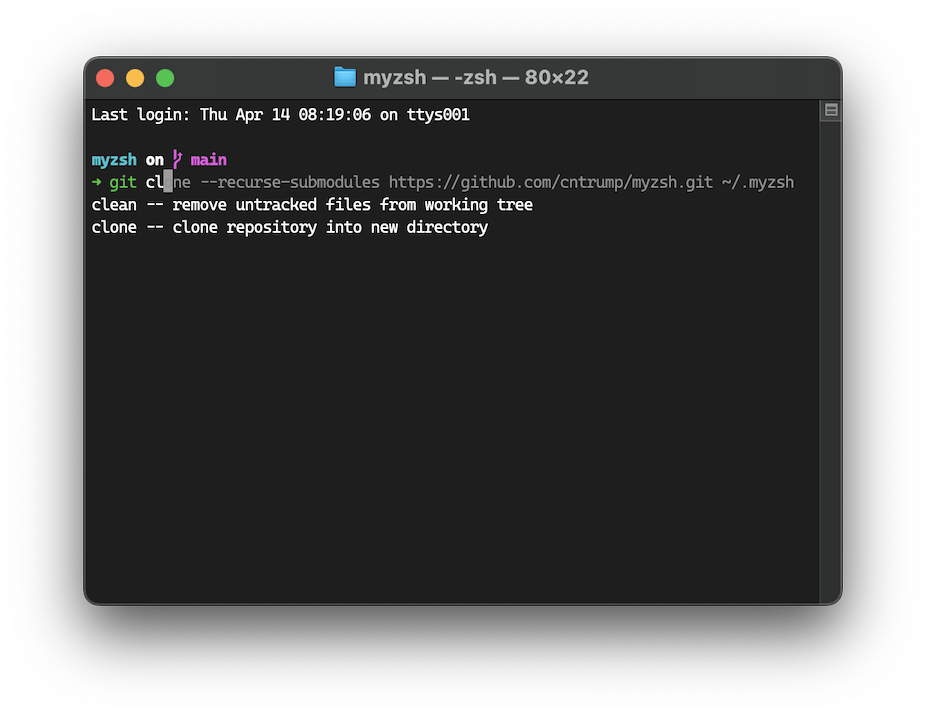

# My ZSH

My custom ZSH configuration.

Features:
- Auto suggestion
- Completion
- Prompt
- Syntax highlighting



## How to use

```bash
cd ~
git clone --recurse-submodules https://github.com/cntrump/myzsh.git ~/.myzsh
echo "source ~/.myzsh/my.zsh" >> ~/.zshrc
```

Reopen Terminal.
